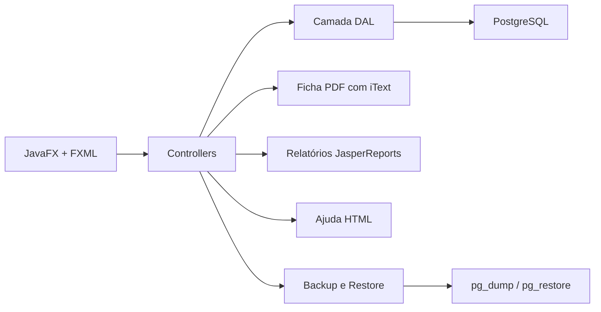
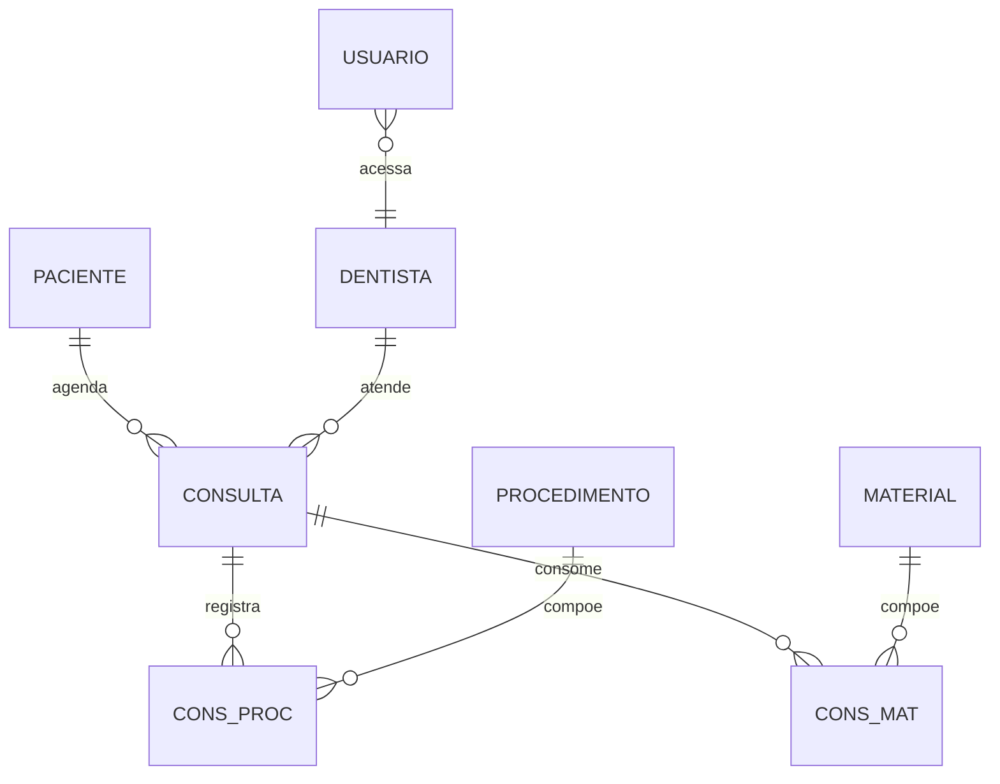

# 🦷 DentalFX

<p align="left">
  
  
  
  
  
  
  
  
</p>

O **DentalFX** é um sistema desktop em **JavaFX** para agendamento e acompanhamento de consultas em clínicas odontológicas. A aplicação permite cadastrar pacientes, dentistas, usuários, procedimentos e materiais, além de organizar agendas por profissional e registrar o atendimento realizado.

Este projeto foi desenvolvido como trabalho bimestral acadêmico, mas está estruturado para demonstrar evolução técnica em um cenário mais completo que um CRUD simples: interface desktop, banco relacional, regras de agenda, níveis de acesso, relatórios e geração de PDF.

## 🎯 Objetivo

Clínicas odontológicas precisam controlar agendas individuais de dentistas, dados clínicos de pacientes, procedimentos realizados e materiais utilizados em cada atendimento.

O **DentalFX** informatiza esse fluxo, centralizando os cadastros e permitindo que a consulta seja acompanhada desde o agendamento até o registro final do atendimento.

## ✨ Funcionalidades

- Cadastro de pacientes com CPF, endereço, contato e histórico clínico.
- Cadastro de dentistas com CRO, telefone e e-mail.
- Cadastro de usuários com níveis de acesso.
- Cadastro de procedimentos com tempo médio e preço.
- Cadastro de materiais com preço.
- Agendamento de consultas por dentista, data e horário.
- Cancelamento de consultas pré-agendadas.
- Registro de atendimento com relato textual.
- Associação de procedimentos e materiais utilizados no atendimento.
- Emissão de ficha do paciente em PDF.
- Relatórios básicos de pacientes, dentistas, materiais, procedimentos e agenda do dia.
- Relatório analítico de atendimentos com filtros por período e dentista.
- Backup e restauração do banco com ferramentas do PostgreSQL.

> 📌 O envio automático de e-mails de lembrete faz parte do escopo proposto no enunciado, mas pode ser tratado como melhoria futura.

## 🧠 Diferenciais Técnicos

- **JavaFX com FXML** para separação entre interface e lógica de tela.
- **PostgreSQL relacional** com chaves estrangeiras entre consultas, pacientes, dentistas, procedimentos e materiais.
- **Padrão em camadas**, separando controllers, entidades, DALs e utilitários.
- **JDBC com PreparedStatement** em fluxos principais de cadastro e login.
- **JasperReports** para relatórios operacionais e analíticos.
- **iText** para geração de ficha do paciente em PDF.
- **Controle de acesso por nível de usuário**:
  - Nível 1: administrador.
  - Nível 2: secretaria/cadastros/agendamento.
  - Nível 3: dentista/atendimento.

## 🧱 Arquitetura



## 🗃️ Modelo Relacional



## 🛠️ Tecnologias Utilizadas

- **Java**
- **JavaFX**
- **FXML**
- **Maven**
- **PostgreSQL**
- **JDBC**
- **JasperReports**
- **iText PDF**
- **HTML/CSS**

## 📁 Estrutura do Projeto

```text
DentalFX_Finalizado/
├── ajuda/                         # Páginas HTML de ajuda
├── MyReports/                     # Templates e relatórios Jasper
├── src/main/java/unoeste/fipp/
│   └── dentalfx/
│       ├── db/dals/               # Acesso a dados
│       ├── db/entidades/          # Entidades do domínio
│       ├── db/util/               # Conexão e utilitários de banco
│       ├── utils/                 # PDF, máscaras e segurança
│       └── *Controller.java       # Controllers JavaFX
├── src/main/resources/unoeste/fipp/dentalfx/
│   ├── *.fxml                     # Telas JavaFX
│   ├── *.css                      # Estilos
│   └── *.png                      # Ícones e imagens
├── sisdentaldb.sql                # Script para criação do banco
├── pom.xml
└── README.md
```

## 📊 Relatórios

O sistema possui relatórios gerados com **JasperReports**:

- Relação de pacientes.
- Relação de dentistas.
- Relação de materiais.
- Relação de procedimentos.
- Agenda do dia.
- Relação analítica de atendimentos por data e/ou dentista.

## 🧾 Geração de PDF

A ficha do paciente é gerada com **iText**, reunindo dados cadastrais e informações clínicas em um arquivo PDF local. Os PDFs gerados ficam fora do Git para manter o repositório limpo.

## 🧹 Organização do Repositório

Arquivos gerados, backups locais, PDFs, `target/`, configurações de IDE e binários do PostgreSQL não são versionados.

Isso mantém o repositório focado no que importa para avaliação técnica:

- Código-fonte.
- Telas FXML.
- Script de banco.
- Relatórios Jasper.
- Documentação.
